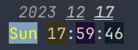

# color_timer

基于 [console_codes](../../ShellKit_console_codes.sh) 实现的终端闹钟。

## Usage

```
Usage:
  color_alarm {sec} [{msg}]
```

执行后开始计时 `{sec}` 秒，并在终端右上角显示当前日期和时间，每 0.1s 刷新一次。计时到达后，在光标所在行打印警示信息 `{msg}`，如没有传入，则默认为 `Alert!`。最后，以 0.02s 为间隔，闪烁终端 5 次。



## ASSERT_ENV

该应用额外依赖了 `date`, `tput` 等命令。此外，封装了自己的 `SLEEP` 命令，展示了 `assert_env` 的重复注册特性。
